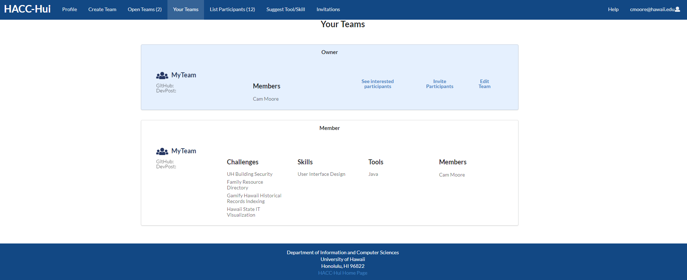

	Hacc-Hui is a website designed to help simplify the team creation process for the Hawaii Annual Code Competition. Hacc-Hui allows users to not only create, but also join already created teams to participate in the HACC. Additionally, Hacc-Hui allows users to create a profile which can help potential team mates to learn more about each other as well as the skills that each individual can bring to the team for the project.

	During the production of Hacc-Hui there were three major development periods where the website saw major updates and changes. In the first phase of development I worked on designing and implementing a way for users to delete their Hacc-Hui account. This job required implementing all pages that would be required for a user to go through the account deletion process as well as interfacing these pages with the internal database. The deletion process would also ask the user to give feedback on precisely why they were choosing to leave the Hacc-Hui website. This feedback would be saved so that we would have a record of common reasons why users were leaving so that we could hopefully improve the site based on the feedback we received.

	In the second period of development I was responsible for implementing pages and processes necessary to allow users to delete teams which they were the owners of. A team being deleted would essentially mark it as inactive on the website as once a team was defined with a name, a team with the same name could not be created even if the previous was deleted. This required extensive use of the backend database so as to remove the team from active searches but maintain a database of names which could no longer be used.

	Finally, during the third period of development I implemented the pages and methods to allow for the creation of teams with members who may not necessarily be users on Hacc-Hui yet. In the event that a team member was not yet a user on Hacc-Hui, the team leader would be notified as to which team members were not currently users on Hacc-Hui. As the Hacc-Hui website relies on Slack/Slackbots for much of team creation, I had to engineer a method for capturing when a slackbot failed to communicate with a team member as well as which user the slackbot had failed to reach. This allowed the team leader to be able to identify which team members had successfully been added to the team and which had yet to create their user on Hacc-HUI.

	Outside of these three major periods of development, I also cleaned up several pages and files which were severely cluttered by commented out code and code that was left over from development testing that no longer needed to be included.

	My team was called 400iq and consisted of myself, Lucy Rock, Kelli Tamashiro, and Jennifer Hsu. Our team allowed individuals to volunteer for what they wanted to do as well as assigned people to do tasks that were as yet without a developer. To coordinate all this, our team would have two meetings a week to discuss progress made on our work, as well as share any information we had learned that could help out the other developers. These weekly meetings ensured that there were minimal surprises in development and allowed our team to catch problems before they spiraled into being a major issue. 

	In addition to our weekly meetings, we would communicate in a text chat channel to request and provide aid if someone started running into errors in code, or just hit a brick wall in development. This combined with our weekly meetings significantly aided our team's development process as there were very few issues/surprises when it finally came time to combine our code into a singular working product.

	During development each team member was directly responsible for implementing the work they had previously agreed to. Additionally, each member would try and answer/help with any questions posted in the text chat channel as much as they could. While no one was told they had to help, everyone on the team was more than willing to aid others with any problems they ran into. During days when we were pushing our code as a final product, the entire team would hop in a voice channel to help combine and finalize all the code into a single cohesive product ready for submission.

	ICS 414 was a great experience which helped familiarize everyone with the pitfalls and potential problems that arise when code is worked on by a group of developers instead of an individual. I was lucky to have a great team that had very few issues caused by having multiple developers. The most important takeaway for me was that a team's success was directly tied to communication between team members. Our weekly meeting may have required more time taken away from coding in order to meet up with each other, but they had the effect of limiting the amount of surprises and problems. This allowed each of us to focus on the problems in the code rather than any problems within the team.

