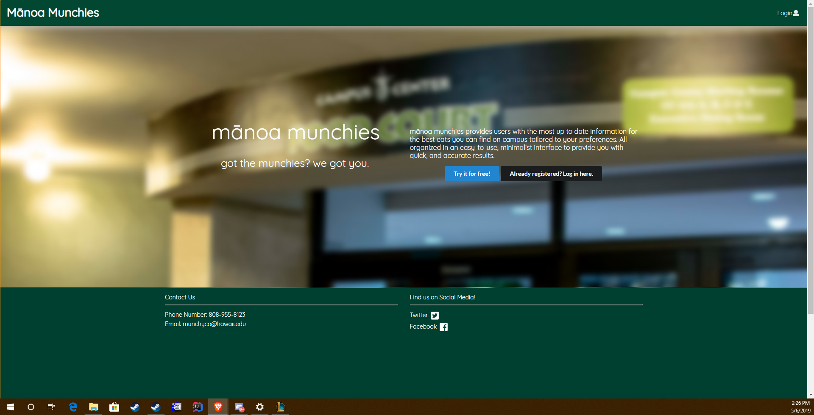
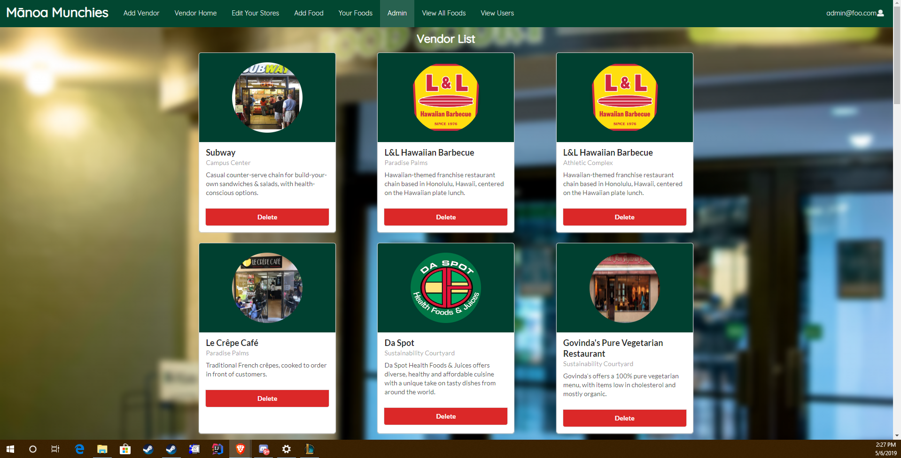
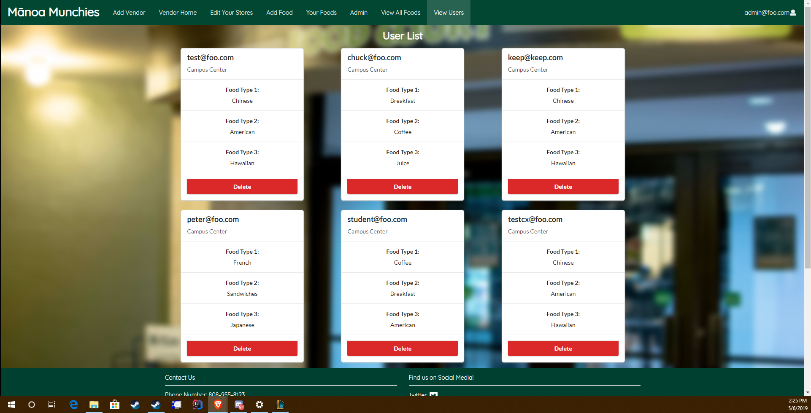

<b>What is Manoa Munchies</b>

  In my ICS 314 course our final project was to build a web app using various languages and frameworks that were taught throughout the course. My group chose to build an app which we would aggregate food options from around campus and provide the user the ability to see what is available on campus using preferences that they provide. Users are broken down into three categories, vendor, customer, and admin. Each of these three roles had its own limitations set on what could be displayed, as well as what could be available to the user. The system uses multiple mongo databases to hold and record information that pertinent to the user and their food options on campus and display them in a dedicated page where they could see info about each item.

<b>My Responsibilities</b>

  Much of my work on the project was spent building pages to effect changes on several of the databases depending on who is signed in. Specifically I was responsible for handling admin pages to delete users, vendors, and foods. Additionally, I was responsible for the vendors ability to add food items, as well as the pages required for editing the vendors stores they already control. Lastyly, the pages requiring information from the databases were designed in such a way so as to still work even if no information was supplied.
 

 

 
  

 

 

 <b>What was learned</b>
 

  Through this month long project my group and I learned valuable lessons for designing and deploying software that is being collaborativly worked on. One of the first things we learned was to meet early, and to meet often. While our first deployment should have had the least hiccups, given that we had the simplest code in that moment. Despite this, we spent as much time on this first deployment as we did on the last deployment. Also, we learned to start early and commit often to our SCCS. This change made merging and combining our code much simpler. Ultimatly, being able to work on a project of this scale, and completeing it in a monthish was a great expierence for developing software engineering skills.
 

<a href="https://munchyco.github.io">Manoa Munchies DevSite</a>
