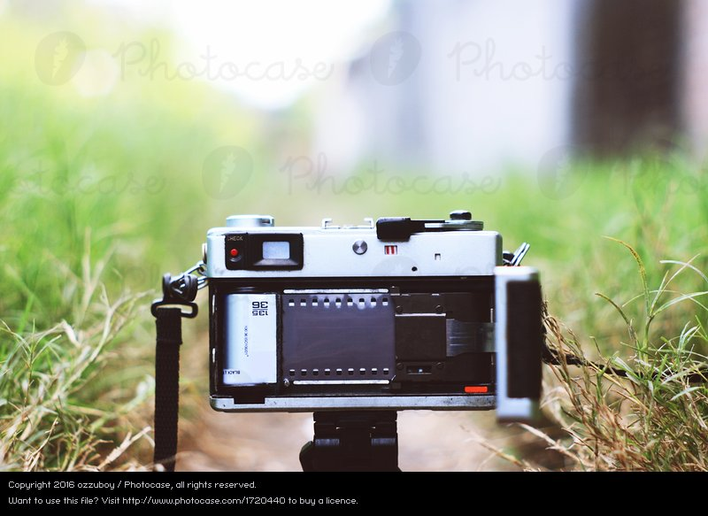
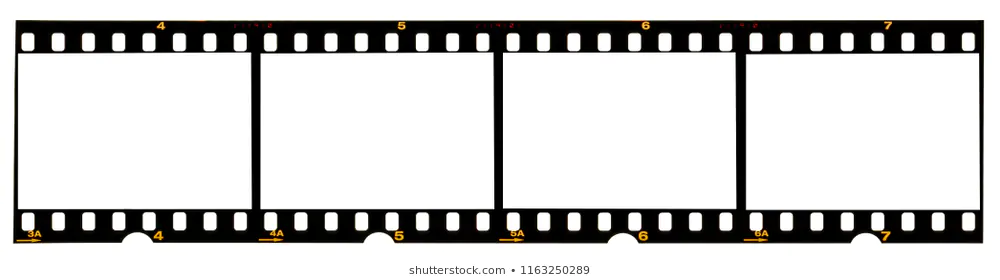

After a few semesters of only sciences, I chose to take a photography course from the University of Hawaii. Through the course I learned how cameras work, camera history, and how to use the camera as a tool to produce art and other things. We used film cameras and developed our own film in a dark room. The class itself did not require much from you day to day, but would have aggressive deadlines for multiple prints to be ready to show for a grade. If you didn’t have enough prints your grade would suffer.

The exercise of creating multiple art pieces on a deadline came with significant challenges. First, each finished print was the culmination of hours of work in the dark room to print the photo so well. Second the volume of required prints required you to work efficiently. For the entire span you were expected to have eight or more quality prints done every two weeks. Each individual photo takes hours to get right, and we would be showing them to our teacher and classmates when it was due so it’s incredibly easy to see who put in effort with their prints and who just threw them together. 

This experience helped teach me how to accomplish multiple, quality, finished products on a deadline. This required significant time management and planning skills as the photo projects were in addition to my ongoing ICS degree.

